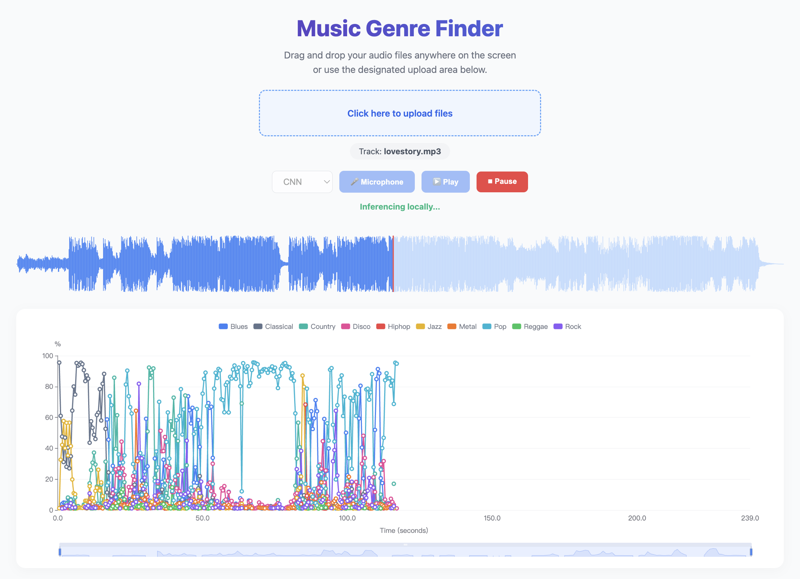
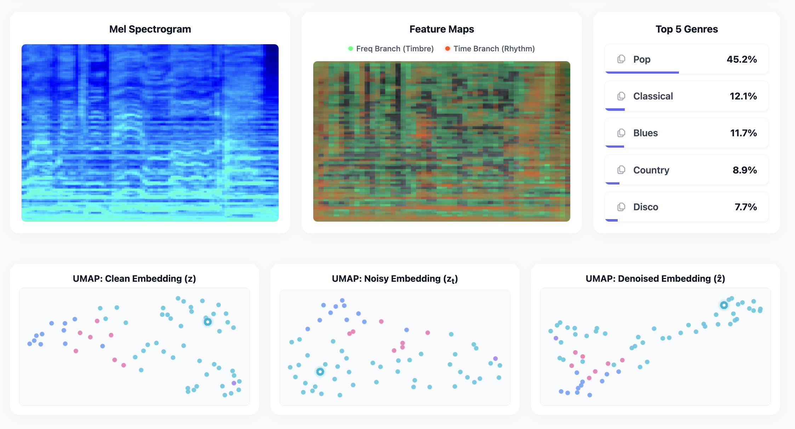
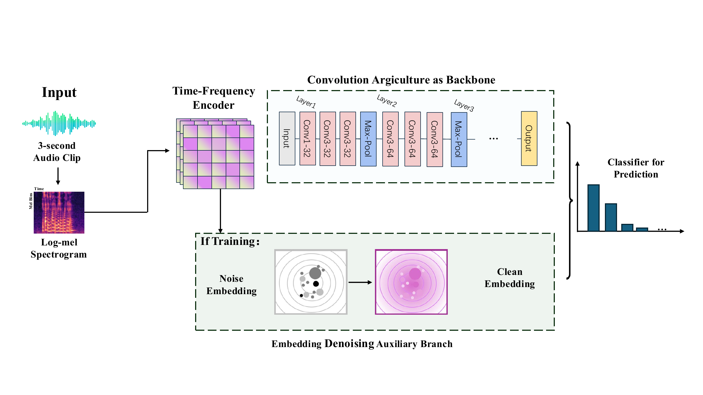

# Music Genre Classification


## Demo Presentation
[Live Demo is here to use!](https://music.yelants.top/)
### Main UI for Prediction:  
 

### Visualization Output:
 


## Project Flowchart



This project performs music genre classification and contains three main parts:

- `model/`: data preprocessing, MusicFlowNet/EMF training, and single-audio inference scripts.
- `e2e-model/`: ONNX export utilities for browser-side end-to-end inference.
- `frontend/`: a Vue + ONNX Runtime Web visualization app.

## 1. Environment and Data Setup

Prepare the Python/frontend environments first, then place the GTZAN dataset under the project directory.

### Python Environment

Install the dependencies used by preprocessing, training, and inference:

```bash
python -m venv .venv
source .venv/bin/activate
pip install numpy scipy librosa soundfile torch torchaudio matplotlib onnx onnxruntime
```

For GPU training, install the PyTorch build that matches your CUDA version. The training script uses CUDA by default; for quick CPU-only debugging, add `--force_cuda false` to the training command.

### Frontend Environment

Node.js 18+ is recommended:

```bash
cd frontend
npm install
```

### Dataset Layout

GTZAN download link: https://www.kaggle.com/datasets/andradaolteanu/gtzan-dataset-music-genre-classification

Only the `genres_original` part of the dataset is needed. The expected layout is:

```text
gtzan_dataset/
  genres_original/
    blues/
      blues.00000.wav
      ...
    classical/
    country/
    disco/
    hiphop/
    jazz/
    metal/
    pop/
    reggae/
    rock/
  GTZAN_SONGTITLE_ARTIST.csv   # optional
```

`GTZAN_SONGTITLE_ARTIST.csv` is optional artist metadata. If present, the preprocessing script uses it for artist-aware train/val/test splits. If it is missing, the split falls back to song-level random assignment.

## 2. Data Preprocessing

Open `model/preprocessing.py` and update the paths:

```python
ROOT_DIR = Path("/path/to/Music-Genre-Classification")
RAW_DIR = ROOT_DIR / "gtzan_dataset" / "genres_original"
OUT_DIR = ROOT_DIR / "model" / "preprocessed"
```

Then run:

```bash
python model/preprocessing.py
```

The preprocessing script reads raw audio files such as `.mp3`, `.wav`, `.au`, `.ogg`, and `.flac`, resamples them to 22050 Hz mono, applies basic cleaning, and writes segmented `.wav` files. It does not generate log-mel image files at this stage.

Expected output:

```text
model/preprocessed/
  full_base/
  full_clean_light/
  seg_1s_base/
  seg_3s_base/
    train/<genre>/*.wav
    val/<genre>/*.wav
    test/<genre>/*.wav
  seg_10s_base/
  seg_30s_base/
  manifests/
    songs_all.csv
    train.csv
    val.csv
    test.csv
    segment_manifest.csv
    bad_files.csv
```

`bad_files.csv` records audio files that could not be read or processed.

## 3. Model Training

Basic command:

```bash
python model/train_musicflownet.py
```

Recommended settings:

```bash
python model/train_musicflownet.py \
  --temporal cnn \
  --epochs 60 \
  --build_mel true \
  --export_explain false \
  --force_cuda true
```

Available temporal backbones:

```text
conformer, mlp, lstm, rnn, cnn, resnet, transformer
```

The training script:

- Reads train/val/test segments from `model/preprocessed/seg_3s_base`.
- Converts `.wav` segments to log-mel `.npy` feature caches under `model/mel_cache/lm3_base_v1`.
- Computes the train-set log-mel mean and standard deviation.
- Trains the model and saves the best checkpoint based on validation performance.
- Reports segment-level and song-level test metrics.
- Copies the best checkpoint to `model/emf_v1_out/best_emf_v1.pt` by default, so the inference script can use it directly.

Default training outputs:

```text
model/emf_train_runs/<temporal>_<epochs>ep_s<seed>/
  best_emf_v1.pt
  config.json
  history.json
  test_metrics.json
  test_predictions_v1.csv
  mel_items.csv

model/emf_train_runs/train_summary.csv
model/emf_v1_out/best_emf_v1.pt
```

If GPU memory is not enough, reduce these values near the top of `model/train_musicflownet.py`:

```python
BATCH_SIZE = 64
NUM_WORKERS = 0
```

## 4. Single-Audio Inference

After training, run `model/predict_audio.py` on any audio file:

```bash
python model/predict_audio.py \
  --audio /path/to/song.wav \
  --checkpoint model/emf_v1_out/best_emf_v1.pt \
  --out_dir model/infer_out \
  --topk 3
```

The inference script:

- Converts the input audio to 22050 Hz mono.
- Applies the same basic cleaning as training.
- Splits the audio into 3-second windows with a 1.5-second hop.
- Predicts each segment and averages probabilities for the final song-level result.

Example output:

```text
model/infer_out/
  <audio_name>_segment_predictions.csv
  <audio_name>_summary.json
```

`summary.json` contains the song-level top-k prediction. `segment_predictions.csv` contains each segment prediction and its attention peak position.

## 5. Frontend Usage

The frontend loads ONNX models from:

```text
frontend/public/models/
  emfv1_cnn_e2e.onnx
  emfv1_lstm_e2e.onnx
  emfv1_resnet_e2e.onnx
```

Start the development server:

```bash
cd frontend
npm run dev
```

Open the local URL printed by Vite. The app supports:

- Uploading an audio file and running inference during playback.
- Real-time microphone inference.
- Switching between CNN, LSTM, and ResNet ONNX models.
- Visualizing genre probabilities, mel spectrograms, CNN feature maps, top genres, and UMAP embeddings.

## 6. ONNX Model Export

If you retrain the model and want to update the frontend ONNX files, export the new PyTorch checkpoint:

```bash
python e2e-model/export_onnx.py
```

Before running export, update the checkpoint search path in `e2e-model/export_onnx.py` so it points to your actual `best_emf_v1.pt`.

The frontend expects these filenames:

```text
emfv1_cnn_e2e.onnx
emfv1_lstm_e2e.onnx
emfv1_resnet_e2e.onnx
```

Place the exported files under:

```text
frontend/public/models/
```
