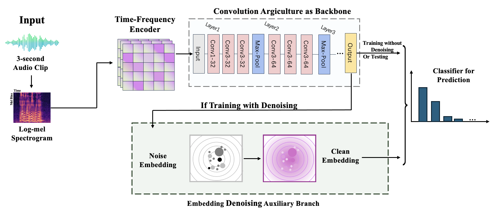

# Music Genre Classification

本项目用于 GTZAN 音乐流派分类，包含模型训练、消融实验、ONNX 端到端推理和前端展示。当前训练代码统一维护六个 backbone：`cnn`、`resnet`、`lstm`、`rnn`、`mlp`、`transformer`；旧的第七种主干路线已从正式训练与消融入口中移除。

## Demo

[Live Demo is here to use!](https://music.yelants.top/)

### Main UI for Prediction


### Visualization Output


## Project Flowchart



## 项目结构

```text
Music-Genre-Classification/
├── model/
│   ├── preprocessing.py           # GTZAN 切片与 mel 特征预处理
│   ├── train_musicflownet.py      # 主训练入口
│   ├── backbones.py               # 六个 backbone 的统一实现
│   ├── predict_audio.py           # 单音频推理
│   ├── plot_denoise_tsne.py       # 单模型去噪前后 t-SNE
│   └── combine_tsne_grid.py       # 多模型 t-SNE 合成图
├── Ablation/
│   ├── code/                      # seed=82 的六模型消融脚本
│   └── result/                    # seed82 正式输出目录
├── e2e-model/                     # ONNX 导出与验证
├── frontend/                      # Vue + ONNX Runtime Web 前端
└── docs/assets/                   # README 与报告用图片
```

说明：GitHub 仓库中的 `Ablation/result` 只保留 `seed82` 正式输出目录，旧调参过程、其他 seed 和非正式可视化结果不再放入仓库，避免和最终消融表混在一起。

## 环境准备

Python 训练与分析依赖：

```bash
pip install numpy scipy librosa soundfile torch torchaudio matplotlib scikit-learn onnx onnxruntime
```

如果使用 GPU，请安装和本机 CUDA 匹配的 PyTorch。训练脚本默认优先使用 CUDA；只调试流程时可以加 `--force_cuda false`。

前端依赖：

```bash
cd frontend
npm install
```

## 数据准备

GTZAN 数据集下载地址：

https://www.kaggle.com/datasets/andradaolteanu/gtzan-dataset-music-genre-classification

建议放成如下结构：

```text
model/
└── gtzan_dataset/
    ├── genres_original/
    │   ├── blues/
    │   ├── classical/
    │   └── ...
    └── GTZAN_SONGTITLE_ARTIST.csv   # 可选
```

运行预处理：

```bash
python model/preprocessing.py
```

训练代码默认读取：

```text
model/preprocessed/seg_3s_base
model/mel_cache/lm3_base_v1
```

## 主模型训练

直接运行默认 CNN backbone：

```bash
python model/train_musicflownet.py
```

指定 backbone：

```bash
python model/train_musicflownet.py --temporal cnn --epochs 60 --build_mel true --export_explain false
```

可选 backbone：

```text
cnn, resnet, lstm, rnn, mlp, transformer
```

当前整理后的默认实验参数写在 `model/train_musicflownet.py` 中。六个模型共享同一套训练、分类头和 denoise 模块，主要差异只来自 temporal backbone。

## 六模型消融

消融脚本放在 `Ablation/code/`，固定使用 `seed=82` 和 `epochs=60`。每个模型会跑两种设置：

- `full_dn`：使用 denoise 模块；
- `no_dn`：关闭 denoise 模块。

单独跑某个模型：

```bash
python Ablation/code/run_cnn_ablation.py
python Ablation/code/run_resnet_ablation.py
python Ablation/code/run_lstm_ablation.py
python Ablation/code/run_rnn_ablation.py
python Ablation/code/run_mlp_ablation.py
python Ablation/code/run_transformer_ablation.py
```

一次跑完六个模型：

```bash
python Ablation/code/run_all_seed82_ablation.py
```

输出位置：

```text
Ablation/result/seed82/
├── runs/       # 每次训练的 checkpoint、history、metrics
├── tables/     # 汇总表
├── tsne/       # 单模型 t-SNE
└── figures/    # 六模型合成图
```

训练全部结束后，脚本会再生成 t-SNE 图和汇总图，减少中途画图导致的混乱。

## 单音频推理

```bash
python model/predict_audio.py --audio path/to/audio.wav --checkpoint path/to/best_model.pt
```

如果 checkpoint 中记录了训练配置，推理脚本会优先按 checkpoint 的 backbone 参数构建模型。

## ONNX 与前端

导出 ONNX：

```bash
python e2e-model/export_onnx.py
```

验证 ONNX：

```bash
python e2e-model/verify_e2e.py
```

启动前端：

```bash
cd frontend
npm run dev
```

前端用于展示音频上传、流派预测和可视化结果，模型文件由 `e2e-model/` 导出。
